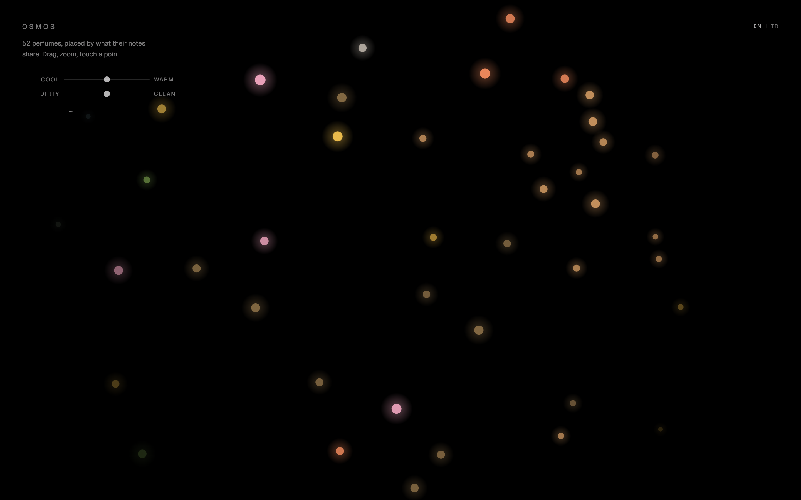
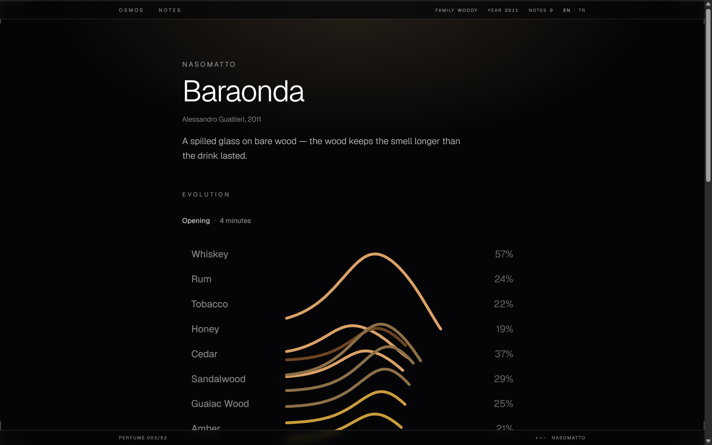
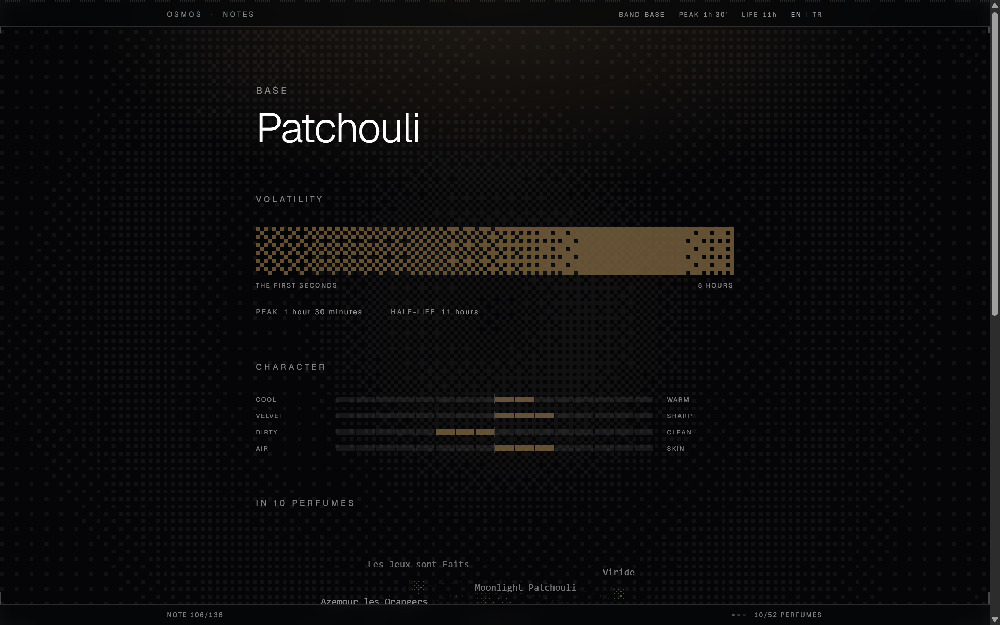

# OSMOS

An attempt to make scent readable. 52 perfumes and 136 notes; there are no
photographs anywhere — everything on screen is drawn from data.

**[osmos-three.vercel.app](https://osmos-three.vercel.app)** — the site is live.

[](https://github.com/Sooosii/osmos/actions/workflows/ci.yml)



<sub>The door: 52 perfumes on a plane where position comes from shared notes.
Colour is the dominant family, size the third component. Drag, zoom, touch a
point.</sub>



<sub>A perfume: the evolution signature turns on its own for eight hours, drawn
on canvas from the volatility of each note. No charting library is used
anywhere in this project.</sub>



<sub>A note: volatility as a dithered field, four character axes, and the
perfumes that carry it in a rotating constellation.</sub>

```bash
npm install
npm run dev     # http://localhost:3000
npm run build   # 392 pages, all static
npm test        # vitest
npm run lint
```

## Pages

The site is bilingual: English lives at the root, Turkish under `/tr`. Every
route below exists in both.

| path | what |
|---|---|
| `/` | **The scent space** — the door. 52 perfumes on a plane where position comes from shared notes. Drag, zoom, touch a point. Sliders let you search by feel instead of by name, and the query travels in the address: `?feel=0.9,,0.2` |
| `/perfume/[id]` | A perfume: house and year, a turning evolution signature, its notes, its neighbours in the space |
| `/notes` | The index of 136 materials, grouped by volatility band |
| `/note/[id]` | A note: its own measurements, and the turning constellation of perfumes that carry it |
| `/evolution`, `/space` | Verification screens — internal tools, not indexed |
| `/u/[username]` | A profile: four perfumes and a signature drawn from them |
| `/signin`, `/settings`, `/privacy` | The optional account |

New perfumes travel by two channels: an RSS feed at
[`/feed.xml`](https://osmos-three.vercel.app/feed.xml), and a quiet NOTIFY
button in the frame that delivers a push notification when a perfume enters the
map. The permission prompt opens only when the button is pressed — the site
never asks on its own.

## Accounts are optional

The site is fully usable without one, and browsing signed out stores nothing —
no cookie, no account, no tracking. An account adds exactly one thing: a public
profile at `/u/yourname` holding **four perfumes**, a line you write, and a
signature drawn from those four — concentric rings whose colours are the scent
families and whose dots are note weights. There are no photographs here either,
including profile pictures; the identity mark comes from the data.

Signing in sets one cookie, and that is the only cookie the site ever sets.
Everything stored and how to delete it is on [`/privacy`](https://osmos-three.vercel.app/privacy).

## The data

Three sets, all written by hand under `src/data/`:

- **`perfume-sets/`** — 52 perfumes. Each with its notes by tier (top / heart /
  base) and weight, plus house, year and perfumer.
- **`note-sets/`** — 136 notes, split across three files by volatility band.
  Each carries family weights, volatility (peak minute + half-life) and four
  character axes: temperature, texture, cleanliness, proximity.
- **`families.ts`** — 15 scent families and their colours. **Colour means
  family**, everywhere on the site; after a few pages you can read the code.

`types.ts` describes the whole schema and which display each field drives.

## Two rules the code keeps

**① The computation stays on the server.** The similarity matrix, the
projection and the note database never reach the browser; the client receives
results only — name, colour, weight, depth. `space-marks.ts` and
`note-marks.ts` are the two ends of that contract.

**② Every hand-measured number is held by a test.** Orbit geometry, dither
thresholds and label placement were tuned in a browser; if the camera angle or
the radii change, tests break. The pure modules under `src/lib/` know nothing
about React, the DOM or canvas, and each sits beside its own tests.

## Where the decisions live

Why each feature is the way it is — including the options that were rejected —
is written under `docs/superpowers/specs/`. The comments in the code do the
same job: they explain **why it is this way** and what was tried and dropped,
not what the code does.

## Stack

Next.js 16 (App Router, Turbopack) · React 19 · Tailwind 4 · TypeScript ·
Vitest · Better Auth, Drizzle and Postgres for the account layer. Drawing is
canvas and SVG; there is no charting library.

**Nearly everything is static** — 396 pages, generated at build time. Only two
routes render per request, and only because their content belongs to one
person: `/settings` and `/u/[username]`. The perfume pages keep their "add to
my top four" button without leaving the static set: the session is read in the
browser, never on the server.

The server surface is deliberately small: `/api/push` stores push subscriptions
(Upstash Redis), `/api/auth/*` handles sign-in (Postgres). Push *sending* runs
in a GitHub Action, so the VAPID private key never touches the site. Outbound
requests at runtime: the site's own cookie-less analytics beacon, and — only
when someone signs up — one transactional email.

## Configuration

All optional — the site runs with none of them set:

| variable | what |
|---|---|
| `NEXT_PUBLIC_SITE_URL` | Absolute base for the sitemap, `hreflang` links and share images. Falls back to the host's own production URL, then to `http://localhost:3000`. Set it once a custom domain is in place. |
| `NEXT_PUBLIC_VAPID_PUBLIC_KEY` | Enables the NOTIFY button. Without it the button never renders and the site behaves as before. |
| `KV_REST_API_URL`, `KV_REST_API_TOKEN` | Server-side store for push subscriptions (Upstash Redis; the `UPSTASH_REDIS_REST_*` names are read too). Without them `/api/push` answers 503 in production. |
| `DATABASE_URL` | Postgres for accounts (Neon). Without it the account pages are unreachable and the rest of the site is untouched. |
| `BETTER_AUTH_SECRET` | Signs the session cookie. Changing it signs everyone out. |
| `RESEND_API_KEY`, `MAIL_FROM` | Address confirmation and password reset. Without a key those messages print to the server console in development. **In production a failed send does not fail the sign-up** — the account is created unverified and the error only reaches the server log; the sign-in screen therefore carries a "send the confirmation again" link, which is what unsticks anyone whose letter never arrived. |
| `GOOGLE_CLIENT_ID`, `GOOGLE_CLIENT_SECRET`, `NEXT_PUBLIC_GOOGLE_ENABLED` | Google sign-in. Email and password work without them. The third one is what makes the button appear — set all three together, or the button shows and fails. |

Push *sending* needs its own secrets on the GitHub side (`VAPID_PUBLIC_KEY`,
`VAPID_PRIVATE_KEY`, `VAPID_SUBJECT`, plus the two store variables) — see
`.github/workflows/push-notify.yml`.

Database migrations are applied by hand, never at boot:
`npx tsx --env-file=.env.local scripts/db-migrate.ts`.

See `.env.example`.

## License

All rights reserved — see [LICENSE](LICENSE). The code is readable, but the
selection, the descriptions and the measurements are original work and are not
free to reuse. Ask if you want to.
